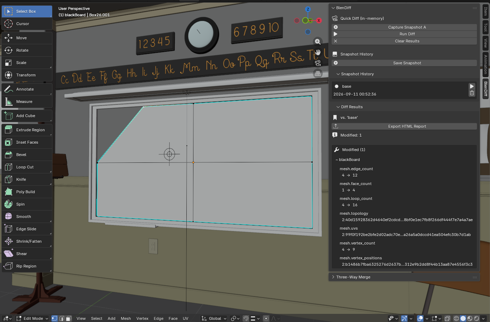
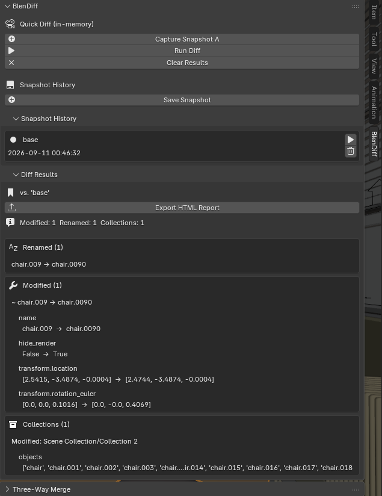
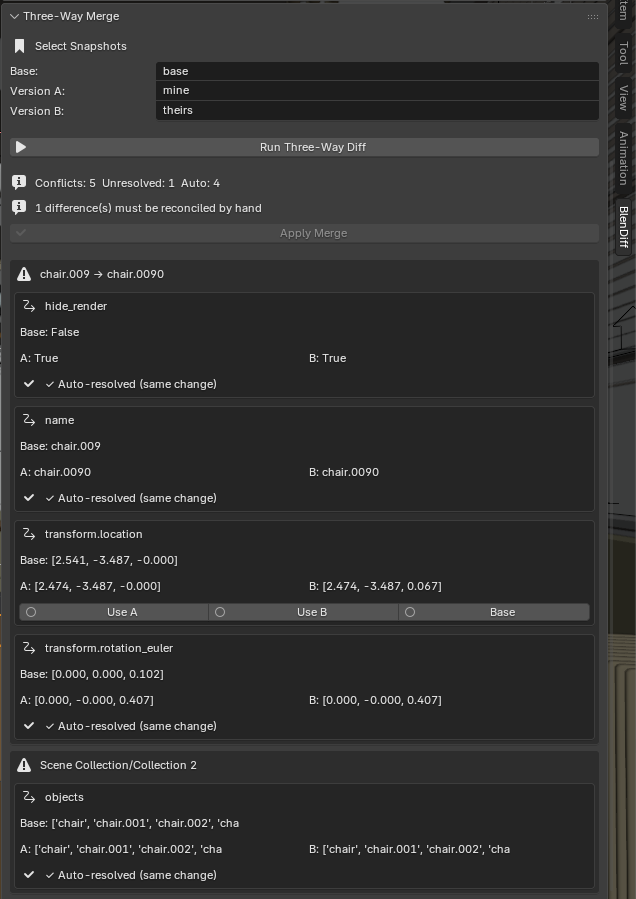

# BlenDiff

**See what changed between two versions of a `.blend` file.**

BlenDiff compares scenes, not bytes. It reads the file through Blender's own
Python API, so instead of "these files differ" you get "this chair moved, that
material was rewired, this mesh was subdivided". Save a snapshot whenever you
reach a point worth keeping, then compare any two of them, or compare one
against whatever is open now.

Snapshots live in a `.blendiff` file next to your `.blend`, so a project folder
holds those two files and nothing else.

---

## Detecting a geometry edit

The blackboard was reshaped in edit mode. BlenDiff picks up the new topology,
the changed vertex positions and the UVs, without storing a copy of the mesh.



## Comparing against a snapshot

Object level changes, property by property. The chair here was renamed, hidden
from renders, moved and rotated, and BlenDiff tracks the rename as a rename
rather than reporting an unrelated deletion and addition.



## Merging two versions

Give BlenDiff a common starting point and two versions that grew apart. It
applies the changes that do not overlap and asks you about the ones that do.
Apply Merge stays disabled until nothing is left undecided.



---

## What it compares

- **Objects**: position, rotation, scale, visibility, parenting and custom properties
- **Meshes**: a moved vertex, a subdivided face or a re-unwrap, caught by comparing
  content digests rather than storing the geometry
- **Materials**: node graphs, node by node, including rewired links and image names
- **Armatures**: bone hierarchy, rest pose, roll, bone collections, pose transforms
  and bone constraints, so a reparented finger or a rewired IK chain is visible
- **Modifiers and constraints**: the whole stack, in order, with per setting detail
- **Animation**: keyframe counts, frame ranges, interpolation, drivers and NLA tracks
- **Scene settings**: render engine, resolution, sampling, output format, colour
  management, world background, cameras and lights
- **Collections**: which objects belong where

Renames are tracked properly. Objects carry a hidden id, so renaming `Cube` to
`Body_LOW` stays one modified object with its other changes intact.

Snapshots also record which of these they captured. If an old snapshot predates
a feature, that part is reported as **not compared** instead of being diffed, so
upgrading BlenDiff never fills your first diff with changes nobody made.

---

## Installation

**Blender 4.2 and newer**

Edit > Preferences > **Get Extensions**, search for **BlenDiff**, click Install.
Updates arrive on their own.

**Blender 3.6 to 4.1**

Download the latest `blendiff-<version>.zip` from
[Releases](https://github.com/Vishrut2403/blendiff/releases) and install it with
Edit > Preferences > Add-ons > **Install from Disk**.

Either way, the panel appears in the 3D viewport sidebar. Press **N** and look
for the **BlenDiff** tab.

---

## Using it

1. Save your `.blend` file. BlenDiff needs somewhere to put its history.
2. Press **Save Snapshot** and give it a name, something like "before rigging".
3. Carry on working.
4. Open **Snapshot History** and press play next to any snapshot to compare it
   against the current scene.
5. **Export HTML Report** writes a single self contained page you can send to
   someone who does not have the file open.

For a merge, take a snapshot of the common starting point, then one of each
version that grew from it, and pick all three in the **Three-Way Merge** panel.

---

## What merge writes back

BlenDiff only claims to apply what it can actually apply. Anything it cannot
write back is shown as read only, so it never asks you to choose a value it
would then discard.

| Applied for you | Reported, but reconcile by hand |
|---|---|
| Position, rotation, scale | Mesh geometry |
| Viewport and render visibility | Modifier and constraint stacks |
| Object names | Keyframes, drivers, NLA strips |
| Collection membership | Material node graphs |
| Parenting, keeping world position | Bone constraints |
| Pose bone transforms | Adding or removing bones |
| Rest bones: parenting, rest pose, roll | Object creation, which needs the source file |
| Custom properties | |
| Camera and light settings | |
| Material slot assignment | |

---

## Also available as a Python library

BlenDiff installs from PyPI as a plain Python package, with no Blender required,
for comparing snapshots in scripts or in continuous integration:

```bash
pip install blendiff
```

See [docs/development.md](docs/development.md) for the command line tool and the
Python API, and [docs/architecture.md](docs/architecture.md) for how the code is
put together.

---

## License

GPL-3.0-or-later. See `LICENSE`.

BlenDiff is licensed under the GNU General Public License v3 or later because
Blender's Extensions Platform requires it: anything using the `bpy` API is
treated as a derivative of Blender, which is itself GPL. The pip package and
the Blender addon ship the same code under the same terms.
